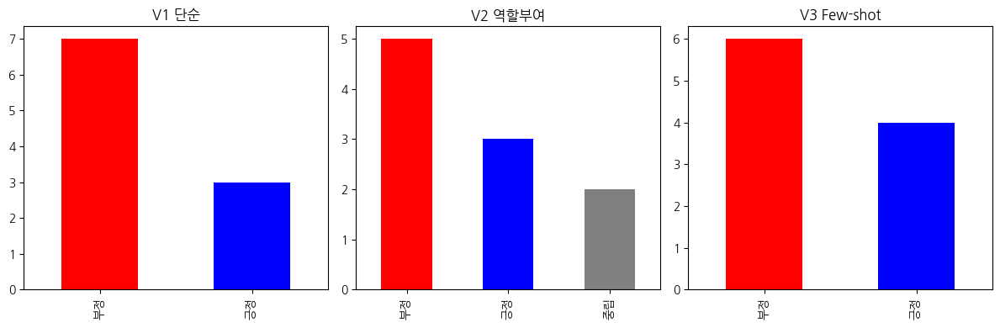

# Prompt-Engineering-Practice

## Prompt Engineering이란
LLM에게 더 좋은 결과를 얻기 위해 프롬프트를 설계하는 것

## API란
서비스를 코드로 갖다 쓸수 있게 해주는 것

이번 연습에서는 서울시립대학교 AI chat의 API Gateway에서 Claude Sonnet 모델을 가져와서 사용


## 증시 크롤링
```
!pip install newspaper3k lxml_html_clean -q
```
- newspaper3k: 뉴스 기사 URL에서 텍스트 추출하는 라이브러리
- lxml_html_clean: import error나서 따로 설치. newspaper3k HTML 정제시 사용

```
import requests
```
 - HTTP 요청 라이브러리
```
client_id = "ClIENT_ID"
client_secret = "CLIENT_SECRET"

url = "https://openapi.naver.com/v1/search/news.json"
params = {
    "query": "코스피 증시",
    "display": 20,
    "sort": "date"
}
headers = {
    "X-Naver-Client-Id": client_id,
    "X-Naver-Client-Secret": client_secret
}

res = requests.get(url, params=params, headers=headers)
items = res.json()["items"]
```
- client id, secret: 네이버에서 발급받은 인증키
- url: 네이버에서 제공하는 뉴스 검색 API endpoint.
- requests.get(): HTTP GET 요청(POST는 보내는거)
- res.json(): 응답을 JSON에서 파이썬 dictionary로 변환

```
from newspaper import Article
articles = []

for item in items[:10]:
    try:
        a = Article(item["link"], language="ko")
        a.download()
        a.parse()
        articles.append({
            "title": item["title"],
            "content": a.text[:500]
        })
    except:
        pass

print(f"수집 완료: {len(articles)}개")
```
- 우선 10개만
- Article(item["link"], language="ko"): language="ko" 해주지 않으면 영어로 처리됨
- download(): URL 접속 및 HTML 가져오기
- parse(): 가져온 HTML에서 본문 텍스트 추출
- a.text[:500]: 토큰 아끼기

```
for i, a in enumerate(articles):
    print(f"[{i+1}] {a['title']}")
    print(a['content'][:200])
    print("---")
```
- 잘 뽑혔는지 확인

## Claude 프롬프트 설계
- 가장 대표적인 단순, 역할부여, Few-shot으로 나눔

```
import anthropic

client = anthropic.Anthropic(
    api_key="API_KEY",
    base_url="서울시립대 API Gateway 사용")

import pandas as pd
import time

def call_api(prompt):
    message = client.messages.create(
        model="claude-sonnet-4-6",
        max_tokens=300,
        messages=[{"role": "user", "content": prompt}]
    )
    return message.content[0].text
```
- 반복수행 하기 위해 함수정의
- 토큰을 조금 더 늘려봄(분석 잘 되라고)
```
# 단순 분류
def analyze_v1(title, content):
    prompt = f"다음 증시 기사를 긍정/부정/중립 중 하나로 분류하고 한 줄 이유를 설명해줘.\n\n제목: {title}\n본문: {content}"
    return call_api(prompt)

# 역할 부여
def analyze_v2(title, content):
    prompt = f"""당신은 증권사 애널리스트입니다.
다음 기사가 주식 시장에 미치는 영향을 분석하세요.

제목: {title}
본문: {content}

다음 형식으로 답하세요:
- 감성: 긍정/부정/중립
- 영향 받는 섹터:
- 투자자 시사점:"""
    return call_api(prompt)

# Few-shot
def analyze_v3(title, content):
    prompt = f"""기사 감성 분류 예시:
기사: "삼성전자 실적 어닝서프라이즈" → 긍정 (실적 호조)
기사: "미 연준 금리 인상 단행" → 부정 (유동성 축소)
기사: "코스피 보합 마감" → 중립 (방향성 없음)

이제 아래 기사를 분류해줘:
제목: {title}
본문: {content}"""
    return call_api(prompt)
```
- 적용하는건 별거 없어서 코드, 설명 생략
## 결과
```
1. 기사: 30조 던진 외인 vs 쓸어 담은 개미…'코스피 방어전' 이번 주가 분수령 ....
[V1 단순] : 중립
**이유:** 외국인의 대규모 매도(부정적 요인)와 개인투자자의 매수(긍정적 요인)가 맞서는 상황을 균형 있게 전달하며, 향후 방향성이 결정되지 않은 관망 국면임을 시사하고 있기 때문입니다.

[V2 역할] : 중립 (불확실성 내포한 혼재)
- **영향 받는 섹터:**
  - **전 섹터 공통 영향** (코스피 지수 전반)
  - 외국인 매도 압력이 강한 **대형주 섹터** (반도체, 자동차, 금융)
  - 개인 투자자 매수세 집중 가능 **낙폭과대 성장주** (2차전지, IT)
  - **증권/금융 섹터** (시장 변동성 확대 시 직접 영향)
- **투자자 시사점:**
  1. 🔴 **외국인 30조 순매도**는 상당한 수급 불안 신호로, 단기 하방 압력 지속 가능성 경계 필요
  2. 🟡 **이번 주가 분수령**이라는 표현은 지지선 테스트

[V3 Few-shot] : 중립 (약한 부정 혼재)
### 📊 분류 근거
| 요소 | 내용 | 신호 |
|------|------|------|
| 외국인 30조 매도 | 대규모 순매도 | 🔴 부정 |
| 개인 매수 대응 | 저가 매수세 유입 | 🟡 중립 |
| "방어전 분수령" | 불확실성 강조 | 🟡 중립 |
| 코스닥 +0.43% | 소폭 상승 마감 | 🟢 약한 긍정 |

### 🔍 종합 판단
> **중립 (부정 우세)**
- 외국인의 **대규모 이탈**이라는 구조적 부정 신호가 존재하나
- 시장이 붕괴되지 않고 **개인이 방어 중**인 상황
```
- 같은 중립이더라도 프롬프트가 정교해질수록 V1 > V3 한국어의 뉘앙스를 파악
- 특히 V3 Few-shot에서는 프롬프트에 명시하지 않았는데도 표 형식과 이모지를 활용해 근거를 분해함


